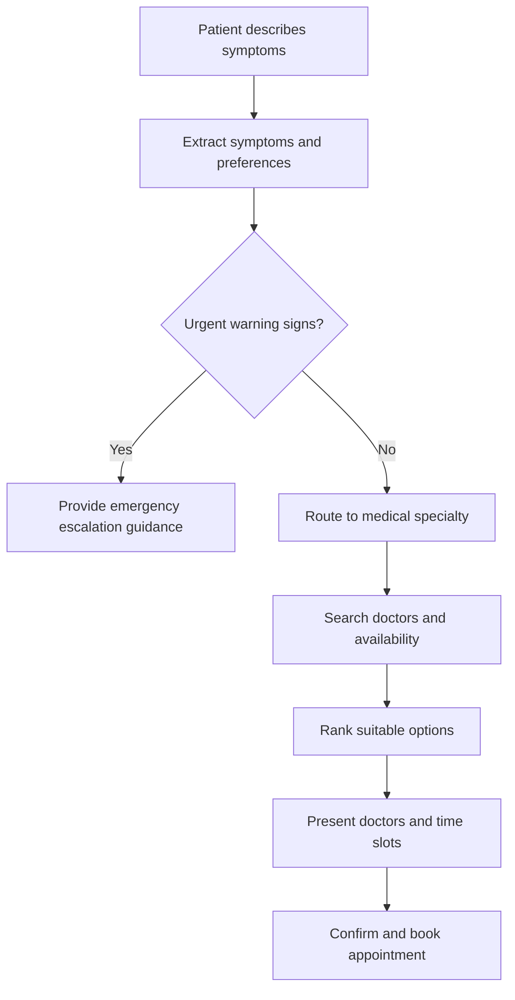

# Architecture

## Overview

MedRoute AI is a backend-first system built around a FastAPI service and a
future LangGraph routing graph. It is designed so LLM-backed intelligence
(routing suggestions) is strictly separated from deterministic data
(doctor directory, appointment slots, bookings).

## Layers

- **api/** — HTTP surface. Thin FastAPI routers, no business logic.
- **schemas/** — Pydantic v2 models shared across layers. The contract
  between API, graph, and services.
- **graph/** — LangGraph state machine that will orchestrate intake →
  routing → doctor search → booking simulation. Empty in Phase 0.
- **providers/** — Abstract interfaces for external capabilities (text
  LLM, speech-to-text, text-to-speech), each with a fake implementation
  for tests and local development, isolating vendor-specific code.
- **safety/** — Emergency escalation detection and disclaimers. Placeholder
  in Phase 0; real logic is a dedicated future milestone.
- **services/** — Business logic orchestrating schemas, providers, and the
  graph. Empty in Phase 0.
- **tools/** — LangGraph tool functions (e.g., doctor search). Empty in
  Phase 0.
- **config/** — Environment-driven settings via pydantic-settings.

## Data flow (target, future milestones)

1. User provides symptoms/preferences (text or voice) → `SymptomIntake`.
2. LangGraph graph produces a `RoutingDecision` (LLM-derived, advisory).
3. Deterministic doctor search returns `Doctor` and `AppointmentSlot`
   records, filtered by the routed specialty.
4. User selects a slot → `BookingRequest` → simulated `BookingConfirmation`.

At every step, LLM output only ever populates advisory fields
(`RoutingDecision`); doctor and appointment data always comes from
deterministic sources, never from generated text.

## Target conversation flow (Phase 1+, not yet implemented)

This mirrors the LangGraph node sequence: safety check → symptom
extraction → specialty routing → doctor search → availability lookup →
recommendation → booking confirmation. The emergency-escalation branch
(`C` → `D`) always takes priority over routine routing, per the
[safety boundary](safety-design.md). Phase 0 ships none of this logic —
only the schemas and package skeleton that will eventually host it.

## Phase 0 scope

Only the package skeleton, abstract provider interfaces with fake
implementations, domain schemas, two read-only endpoints, configuration,
and engineering tooling exist. No graph wiring, no real provider calls, no
persistence.
