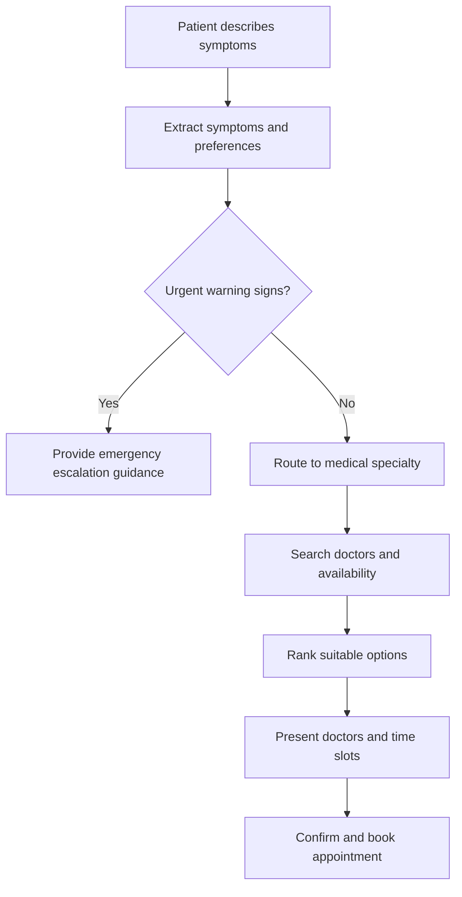

# Architecture

## Overview

MedRoute AI is a backend-first system built around a FastAPI service and a
future LangGraph routing graph. It is designed so LLM-backed intelligence
(routing suggestions) is strictly separated from deterministic data
(doctor directory, appointment slots, bookings).

## Layers

- **api/** — HTTP surface. Thin FastAPI routers, no business logic.
- **schemas/** — Pydantic v2 models shared across layers. The contract
  between API, graph, and services.
- **graph/** — LangGraph state machine that will orchestrate intake →
  routing → doctor search → booking simulation. Empty in Phase 0.
- **providers/** — Abstract interfaces for external capabilities (text
  LLM, speech-to-text, text-to-speech), each with a fake implementation
  for tests and local development, isolating vendor-specific code.
- **db/** — Async SQLAlchemy 2 foundation: declarative `Base`, a lazily
  created engine/session factory, a FastAPI session dependency, a
  `SELECT 1` readiness check (Phase 0.2), and the NPPES provider/location/
  taxonomy/ingestion-run models (Phase 1A). Alembic (`backend/alembic/`),
  not the app, owns all schema creation and changes.
- **ingestion/** — NPPES CSV column mapping (`nppes_mapping.py`, all 15
  taxonomy slots as of Phase 1B), pure row transformation/validation
  (`nppes_transform.py`), chunked streaming ingestion with idempotent
  upserts (`nppes_service.py`), and a CLI (`nppes.py`, run via
  `python -m app.ingestion.nppes`). Validated against a small fixture
  (`backend/tests/fixtures/nppes_sample.csv`) plus a bounded sample of a
  real official file — not the full national dataset, which remains later
  phase work.
- **catalog/** — The small, transparent specialty catalog: sourced NUCC
  taxonomy-code seed data (`nucc_specialties.py`) and an idempotent,
  repeatable seeder (`seed_specialties.py`, run via
  `python -m app.catalog.seed_specialties`).
- **repositories/** — `provider_repository.py`: the single async query that
  joins providers → taxonomies → specialty mappings → specialties →
  locations, with window-function de-duplication so results never contain
  duplicate providers.
- **services/** — `provider_ranking.py` (pure, DB-free, deterministic sort),
  `provider_search_service.py` (orchestrates the repository, ranking, and
  pagination), `multimodal_intake_service.py` (pure evaluation of a
  Phase 1C intake request into a deterministic state — no DB, no network,
  no model calls), and `specialty_routing_service.py` (Phase 1D:
  deterministic keyword-based specialty routing by default, with an
  optional catalog-validated Groq path). No LLM call happens anywhere in
  this layer unless `ROUTING_MODE=groq` is explicitly configured with a
  real key.
- **safety/** — Disclaimer text and user-declared emergency messaging
  (`app/safety/constants.py`). Autonomous/inferred emergency detection
  from free text or media remains a dedicated future milestone.
- **tools/** — LangGraph tool functions (e.g., doctor search). Empty in
  Phase 0.
- **config/** — Environment-driven settings via pydantic-settings.

## Data flow (target, future milestones)

1. User provides symptoms/preferences (text or voice) → `SymptomIntake`.
2. LangGraph graph produces a `RoutingDecision` (LLM-derived, advisory).
3. Deterministic doctor search returns `Doctor` and `AppointmentSlot`
   records, filtered by the routed specialty.
4. User selects a slot → `BookingRequest` → simulated `BookingConfirmation`.

At every step, LLM output only ever populates advisory fields
(`RoutingDecision`); doctor and appointment data always comes from
deterministic sources, never from generated text.

## Target conversation flow (Phase 1+, not yet implemented)

This mirrors the LangGraph node sequence: safety check → symptom
extraction → specialty routing → doctor search → availability lookup →
recommendation → booking confirmation. The emergency-escalation branch
(`C` → `D`) always takes priority over routine routing, per the
[safety boundary](safety-design.md). Phase 0 ships none of this logic —
only the schemas and package skeleton that will eventually host it.

## Phase 1C: multimodal intake contract

`POST /api/v1/intake/validate` (`app/api/v1/intake.py`) is stateless and
non-diagnostic. It accepts text (symptoms, main concern), a *pre-generated*
voice transcript, and image/video URL *references*, plus a
user-declared emergency flag/signal list and an optional preferred-specialty
slug (format-validated only — no catalog lookup, keeping the endpoint
decoupled from the Phase 1B provider-search database entirely).

It validates and normalizes input (`app/schemas/multimodal_intake.py`),
records which modalities were supplied, and evaluates one of three
deterministic states (`app/services/multimodal_intake_service.py`) with
explicit precedence:

1. `emergency` — a user-declared `emergency_concern` or any
   `emergency_signals` entry. Always wins, regardless of what else was
   supplied; directs U.S. users to call 911 and does not continue to
   media processing, specialty routing, or provider search.
2. `needs_clarification` — no emergency, and either no concern modality
   (symptoms/main_concern/transcript/image/video) or no duration was
   supplied. Returns fixed, deterministic clarification questions.
3. `ready_for_multimodal_processing` — no emergency, at least one concern
   modality present, duration present. Means only that the request is
   *structurally* ready for Phase 1D — not that it has been medically
   assessed.

Nothing is persisted (no database table, no Alembic migration, no cache);
media URLs are validated as strings only and are **never fetched, opened,
or probed** — the URL rules (HTTPS-only, no credentials/localhost/private-
IP-literal hosts, no fragment, no query string) are contract-level
hardening, not a complete SSRF defense, since Phase 1C never makes the
outbound request in the first place. A future media-processing service
must independently revalidate destinations at fetch time. Logging is
restricted to safe operational metadata (intake_id, status, per-modality
booleans/counts, whether duration/location were supplied, processing
time) — never symptom text, transcripts, emergency-signal values, or
media URLs.

## Phase 1D: controlled specialty routing & navigation demo

`POST /api/v1/navigate` (`app/api/v1/navigation.py`) composes three
existing pieces without duplicating any of their logic: Phase 1C's
`evaluate_intake()`, a new `specialty_routing_service.route_to_specialty()`,
and Phase 1B's `search_providers_page()`. Emergency/clarification
precedence from Phase 1C is preserved exactly — routing and provider
search only execute when intake status is
`ready_for_multimodal_processing`.

Specialty routing (`app/services/specialty_routing_service.py`) is
*controlled*: it only ever returns a slug already present in the Phase 1B
catalog (`app/catalog/nucc_specialties.py`), never an invented one.

- **Default:** deterministic keyword-overlap matching against each
  specialty's curated `keywords` tuple — no model call.
- **User override:** an explicit `preferred_specialty` always bypasses
  matching entirely, once validated against the catalog.
- **Optional:** `ROUTING_MODE=groq` (plus a real `GROQ_API_KEY`) tries a
  structured JSON-only Groq completion first (a single
  `{"specialty_slug": ...}` field — no chain-of-thought is ever
  requested or surfaced), but its output is *always* re-validated against
  the same catalog and silently falls back to the deterministic path on
  any failure (bad key, network error, malformed JSON, or a slug outside
  the catalog). This path is never exercised by the test suite, which
  always runs with the default `deterministic` mode and no key.

Neither path ever returns a diagnosis, treatment advice, urgency score, or
medical-certainty claim, and neither infers an emergency — that precedence
is entirely Phase 1C's. Image/video URLs are still never fetched or
analyzed; when vision input was supplied, the response includes a plain
`media_note` saying so, mirroring Phase 1C's own `vision_received` flag.

**Streamlit demo UI** (`backend/streamlit_app/`) is the current, lightweight
demo frontend: `app.py` renders the form and calls `/api/v1/navigate`
through `api_client.py`; it contains no routing, ranking, or search logic
of its own. React remains the planned **production** frontend (Phase 5) —
Streamlit does not replace or precede it.

### Beyond Phase 1D (documented, not implemented)

Real text/vision-model understanding (rather than deterministic keyword
matching), vision-model processing producing a non-diagnostic visual
description, model-output validation beyond catalog-slug checking, and
model-evaluation fixtures remain future work. Any of it must still never
diagnose, offer a differential diagnosis, give treatment instructions,
claim medical certainty, infer an emergency autonomously, trust
unvalidated model output directly, or claim that visual interpretation
replaces a clinical examination. Real speech-to-text/text-to-speech
(Phase 4) and the production React frontend (Phase 5) remain separate,
later milestones.

## Phase 0 / 0.2 / 1A / 1B / 1C / 1D scope

The package skeleton, abstract provider interfaces with fake
implementations, domain schemas, configuration, and engineering tooling
exist (Phase 0), plus an async SQLAlchemy/Alembic persistence foundation
and a `GET /api/v1/health/readiness` endpoint (Phase 0.2), plus a
normalized NPPES provider-directory schema and chunked, idempotent CSV
ingestion (Phase 1A), plus a small specialty catalog and deterministic
(no-LLM) provider search API with explainable ranking (Phase 1B), plus a
stateless multimodal intake validation contract with no interpretation
(Phase 1C), plus controlled deterministic specialty routing, an
end-to-end navigation demo endpoint, and a Streamlit demo UI (Phase 1D).
No graph wiring, no real vision/STT/TTS provider calls, no full national
NPPES import, no Qdrant/vector search, and no autonomous/inferred
emergency detection yet — those remain later-phase work.
