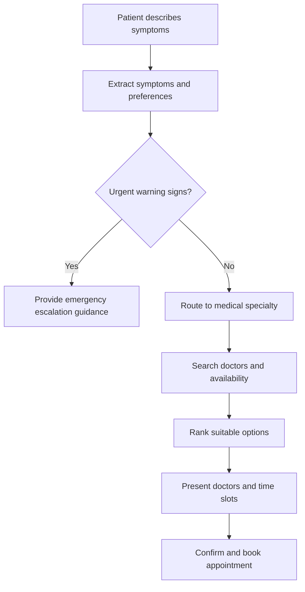

# Architecture

## Overview

MedRoute AI is a backend-first system built around a FastAPI service and a
future LangGraph routing graph. It is designed so LLM-backed intelligence
(routing suggestions) is strictly separated from deterministic data
(doctor directory, appointment slots, bookings).

## Layers

- **api/** — HTTP surface. Thin FastAPI routers, no business logic.
- **schemas/** — Pydantic v2 models shared across layers. The contract
  between API, graph, and services.
- **graph/** — LangGraph state machine that will orchestrate intake →
  routing → doctor search → booking simulation. Empty in Phase 0.
- **providers/** — Abstract interfaces for external capabilities (text
  LLM, speech-to-text, text-to-speech), each with a fake implementation
  for tests and local development, isolating vendor-specific code.
- **db/** — Async SQLAlchemy 2 foundation: declarative `Base`, a lazily
  created engine/session factory, a FastAPI session dependency, a
  `SELECT 1` readiness check (Phase 0.2), and the NPPES provider/location/
  taxonomy/ingestion-run models (Phase 1A). Alembic (`backend/alembic/`),
  not the app, owns all schema creation and changes.
- **ingestion/** — NPPES CSV column mapping (`nppes_mapping.py`, all 15
  taxonomy slots as of Phase 1B), pure row transformation/validation
  (`nppes_transform.py`), chunked streaming ingestion with idempotent
  upserts (`nppes_service.py`), and a CLI (`nppes.py`, run via
  `python -m app.ingestion.nppes`). Validated against a small fixture
  (`backend/tests/fixtures/nppes_sample.csv`) plus a bounded sample of a
  real official file — not the full national dataset, which remains later
  phase work.
- **catalog/** — The small, transparent specialty catalog: sourced NUCC
  taxonomy-code seed data (`nucc_specialties.py`) and an idempotent,
  repeatable seeder (`seed_specialties.py`, run via
  `python -m app.catalog.seed_specialties`).
- **repositories/** — `provider_repository.py`: the single async query that
  joins providers → taxonomies → specialty mappings → specialties →
  locations, with window-function de-duplication so results never contain
  duplicate providers.
- **services/** — `provider_ranking.py` (pure, DB-free, deterministic sort)
  and `provider_search_service.py` (orchestrates the repository, ranking,
  and pagination). No LLM calls anywhere in this layer.
- **safety/** — Emergency escalation detection and disclaimers. Placeholder
  in Phase 0; real logic is a dedicated future milestone.
- **tools/** — LangGraph tool functions (e.g., doctor search). Empty in
  Phase 0.
- **config/** — Environment-driven settings via pydantic-settings.

## Data flow (target, future milestones)

1. User provides symptoms/preferences (text or voice) → `SymptomIntake`.
2. LangGraph graph produces a `RoutingDecision` (LLM-derived, advisory).
3. Deterministic doctor search returns `Doctor` and `AppointmentSlot`
   records, filtered by the routed specialty.
4. User selects a slot → `BookingRequest` → simulated `BookingConfirmation`.

At every step, LLM output only ever populates advisory fields
(`RoutingDecision`); doctor and appointment data always comes from
deterministic sources, never from generated text.

## Target conversation flow (Phase 1+, not yet implemented)

This mirrors the LangGraph node sequence: safety check → symptom
extraction → specialty routing → doctor search → availability lookup →
recommendation → booking confirmation. The emergency-escalation branch
(`C` → `D`) always takes priority over routine routing, per the
[safety boundary](safety-design.md). Phase 0 ships none of this logic —
only the schemas and package skeleton that will eventually host it.

## Phase 0 / 0.2 / 1A / 1B scope

The package skeleton, abstract provider interfaces with fake
implementations, domain schemas, configuration, and engineering tooling
exist (Phase 0), plus an async SQLAlchemy/Alembic persistence foundation
and a `GET /api/v1/health/readiness` endpoint (Phase 0.2), plus a
normalized NPPES provider-directory schema and chunked, idempotent CSV
ingestion (Phase 1A), plus a small specialty catalog and deterministic
(no-LLM) provider search API with explainable ranking (Phase 1B). No graph
wiring, no real LLM/STT/TTS provider calls, no full national NPPES
import, no Qdrant/vector search, and no symptom-to-specialty inference
yet — those are Phase 1C+.
