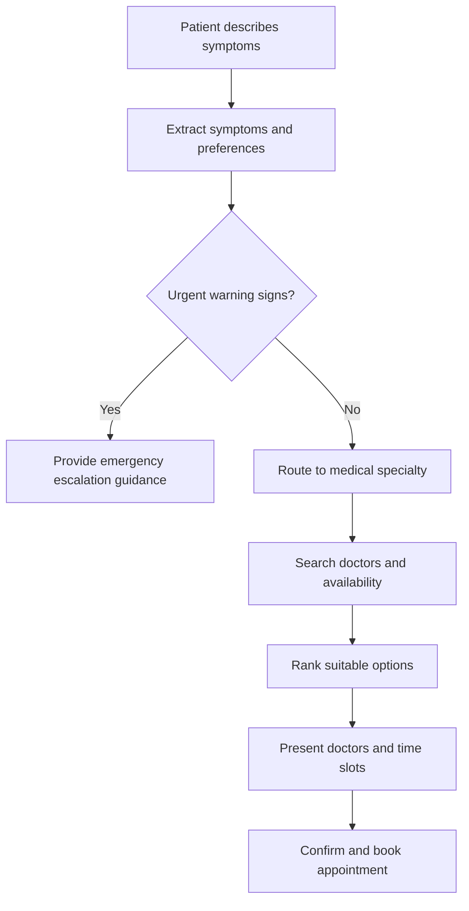

# Architecture

## Overview

MedRoute AI is a backend-first system built around a FastAPI service and,
as of Phase 2B, a compiled LangGraph conversation graph (`app/graph/`) for
`POST /api/v1/converse`. It is designed so LLM-backed intelligence
(routing suggestions, response phrasing) is strictly separated from
deterministic data (doctor directory, appointment slots, bookings).

## Layers

- **api/** — HTTP surface. Thin FastAPI routers, no business logic.
- **schemas/** — Pydantic v2 models shared across layers. The contract
  between API, graph, and services.
- **graph/** — Empty through Phase 2A; as of Phase 2B, a compiled
  LangGraph conversation graph (`state.py`'s `ConversationState`,
  `nodes.py`'s node/conditional-edge functions, `build.py`'s
  `build_conversation_graph()`/`get_conversation_graph()`) orchestrating
  `POST /api/v1/converse`: intake normalization → safety gate →
  clarification (pause/resume) → specialty routing → provider search →
  response composition → text-to-speech. Every node is a thin wrapper
  around an existing, already-tested service — no business logic lives
  here. Booking simulation remains future work (Phase 3).
- **providers/** — Abstract interfaces for external capabilities (text
  LLM, speech-to-text, text-to-speech), each with a fake implementation
  for tests and local development, isolating vendor-specific code. As of
  Phase 2A, `speech_to_text/groq.py` provides a real `SpeechToTextProvider`
  implementation (Groq hosted Whisper); as of Phase 2B,
  `text_to_speech/deepgram.py` provides a real `TextToSpeechProvider`
  implementation (Deepgram hosted Aura). A general-purpose `TextLLMProvider`
  real implementation remains future work — Groq is called directly inside
  `specialty_routing_service.py`/`response_composition_service.py` instead,
  following the same "optional, validated, silent-fallback" pattern.
- **db/** — Async SQLAlchemy 2 foundation: declarative `Base`, a lazily
  created engine/session factory, a FastAPI session dependency, a
  `SELECT 1` readiness check (Phase 0.2), and the NPPES provider/location/
  taxonomy/ingestion-run models (Phase 1A). Alembic (`backend/alembic/`),
  not the app, owns all schema creation and changes.
- **ingestion/** — NPPES CSV column mapping (`nppes_mapping.py`, all 15
  taxonomy slots as of Phase 1B), pure row transformation/validation
  (`nppes_transform.py`), chunked streaming ingestion with idempotent
  upserts (`nppes_service.py`), and a CLI (`nppes.py`, run via
  `python -m app.ingestion.nppes`). Validated against a small fixture
  (`backend/tests/fixtures/nppes_sample.csv`) plus a bounded sample of a
  real official file — not the full national dataset, which remains later
  phase work.
- **catalog/** — The small, transparent specialty catalog: sourced NUCC
  taxonomy-code seed data (`nucc_specialties.py`) and an idempotent,
  repeatable seeder (`seed_specialties.py`, run via
  `python -m app.catalog.seed_specialties`).
- **repositories/** — `provider_repository.py`: the single async query that
  joins providers → taxonomies → specialty mappings → specialties →
  locations, with window-function de-duplication so results never contain
  duplicate providers.
- **services/** — `provider_ranking.py` (pure, DB-free, deterministic sort),
  `provider_search_service.py` (orchestrates the repository, ranking,
  pagination, and — as of Phase 2B — the shared
  `build_provider_search_response()` mapper used by both
  `POST /api/v1/navigate` and the graph's `provider_search` node),
  `multimodal_intake_service.py` (pure evaluation of a Phase 1C intake
  request into a deterministic state, folding in Phase 2B's conservative
  `duration_extraction.py` when no structured duration was supplied — no
  DB, no network, no model calls), `specialty_routing_service.py`
  (Phase 1D: deterministic keyword-based specialty routing by default,
  with an optional catalog-validated Groq path), `voice_transcription_service.py`
  (Phase 2A: upload validation plus transcription orchestration over the
  abstract `SpeechToTextProvider` — never fabricates a transcript on
  provider failure or empty result), `response_composition_service.py`
  (Phase 2B: deterministic non-diagnostic response templating, with an
  optional validated Groq rephrasing), `text_to_speech_service.py`
  (Phase 2B: best-effort synthesis over the abstract `TextToSpeechProvider`
  — never blocks the text response), and `conversation_service.py`
  (Phase 2B: the thin orchestration wrapper around the compiled graph). No
  LLM/STT/TTS call happens anywhere in this layer unless the relevant
  mode setting or provider is explicitly configured with a real key.
- **safety/** — Disclaimer text and user-declared emergency messaging
  (`app/safety/constants.py`). Autonomous/inferred emergency detection
  from free text or media remains a dedicated future milestone.
- **tools/** — LangGraph tool functions (e.g., doctor search). Empty in
  Phase 0.
- **config/** — Environment-driven settings via pydantic-settings.

## Data flow (target, future milestones)

1. User provides symptoms/preferences (text or voice) → `SymptomIntake`.
2. LangGraph graph produces a `RoutingDecision` (LLM-derived, advisory).
3. Deterministic doctor search returns `Doctor` and `AppointmentSlot`
   records, filtered by the routed specialty.
4. User selects a slot → `BookingRequest` → simulated `BookingConfirmation`.

At every step, LLM output only ever populates advisory fields
(`RoutingDecision`); doctor and appointment data always comes from
deterministic sources, never from generated text.

## Target conversation flow (Phase 1+, not yet implemented)



This mirrors the LangGraph node sequence: safety check → symptom
extraction → specialty routing → doctor search → availability lookup →
recommendation → booking confirmation. The emergency-escalation branch
(`C` → `D`) always takes priority over routine routing, per the
[safety boundary](safety-design.md). Phase 0 ships none of this logic —
only the schemas and package skeleton that will eventually host it.

## Phase 1C: multimodal intake contract

`POST /api/v1/intake/validate` (`app/api/v1/intake.py`) is stateless and
non-diagnostic. It accepts text (symptoms, main concern), a *pre-generated*
voice transcript, and image/video URL *references*, plus a
user-declared emergency flag/signal list and an optional preferred-specialty
slug (format-validated only — no catalog lookup, keeping the endpoint
decoupled from the Phase 1B provider-search database entirely).

It validates and normalizes input (`app/schemas/multimodal_intake.py`),
records which modalities were supplied, and evaluates one of three
deterministic states (`app/services/multimodal_intake_service.py`) with
explicit precedence:

1. `emergency` — a user-declared `emergency_concern` or any
   `emergency_signals` entry. Always wins, regardless of what else was
   supplied; directs U.S. users to call 911 and does not continue to
   media processing, specialty routing, or provider search.
2. `needs_clarification` — no emergency, and either no concern modality
   (symptoms/main_concern/transcript/image/video) or no duration was
   supplied. Returns fixed, deterministic clarification questions.
3. `ready_for_multimodal_processing` — no emergency, at least one concern
   modality present, duration present. Means only that the request is
   *structurally* ready for Phase 1D — not that it has been medically
   assessed.

Nothing is persisted (no database table, no Alembic migration, no cache);
media URLs are validated as strings only and are **never fetched, opened,
or probed** — the URL rules (HTTPS-only, no credentials/localhost/private-
IP-literal hosts, no fragment, no query string) are contract-level
hardening, not a complete SSRF defense, since Phase 1C never makes the
outbound request in the first place. A future media-processing service
must independently revalidate destinations at fetch time. Logging is
restricted to safe operational metadata (intake_id, status, per-modality
booleans/counts, whether duration/location were supplied, processing
time) — never symptom text, transcripts, emergency-signal values, or
media URLs.

## Phase 1D: controlled specialty routing & navigation demo

`POST /api/v1/navigate` (`app/api/v1/navigation.py`) composes three
existing pieces without duplicating any of their logic: Phase 1C's
`evaluate_intake()`, a new `specialty_routing_service.route_to_specialty()`,
and Phase 1B's `search_providers_page()`. Emergency/clarification
precedence from Phase 1C is preserved exactly — routing and provider
search only execute when intake status is
`ready_for_multimodal_processing`.

Specialty routing (`app/services/specialty_routing_service.py`) is
*controlled*: it only ever returns a slug already present in the Phase 1B
catalog (`app/catalog/nucc_specialties.py`), never an invented one.

- **Default:** deterministic keyword-overlap matching against each
  specialty's curated `keywords` tuple — no model call. As of Phase 2A,
  a confirmed `voice_input.transcript` is folded into the same token set
  as `symptoms`/`main_concern` before scoring (see Phase 2A below).
- **User override:** an explicit `preferred_specialty` always bypasses
  matching entirely, once validated against the catalog.
- **Optional:** `ROUTING_MODE=groq` (plus a real `GROQ_API_KEY`) tries a
  structured JSON-only Groq completion first (a single
  `{"specialty_slug": ...}` field — no chain-of-thought is ever
  requested or surfaced), but its output is *always* re-validated against
  the same catalog and silently falls back to the deterministic path on
  any failure (bad key, network error, malformed JSON, or a slug outside
  the catalog). This path is never exercised by the test suite, which
  always runs with the default `deterministic` mode and no key.

Neither path ever returns a diagnosis, treatment advice, urgency score, or
medical-certainty claim, and neither infers an emergency — that precedence
is entirely Phase 1C's. Image/video URLs are still never fetched or
analyzed; when vision input was supplied, the response includes a plain
`media_note` saying so, mirroring Phase 1C's own `vision_received` flag.

**Streamlit demo UI** (`backend/streamlit_app/`) is the current, lightweight
demo frontend: `app.py` renders the form and calls `/api/v1/navigate`
through `api_client.py`; it contains no routing, ranking, or search logic
of its own. React remains the planned **production** frontend (Phase 5) —
Streamlit does not replace or precede it.

### Beyond Phase 1D (documented, not implemented)

Real text/vision-model understanding (rather than deterministic keyword
matching), vision-model processing producing a non-diagnostic visual
description, model-output validation beyond catalog-slug checking, and
model-evaluation fixtures remain future work. Any of it must still never
diagnose, offer a differential diagnosis, give treatment instructions,
claim medical certainty, infer an emergency autonomously, trust
unvalidated model output directly, or claim that visual interpretation
replaces a clinical examination. Real speech-to-text was delivered in
Phase 2A and text-to-speech in Phase 2B (both below); vision input
(Phase 2C) and the production React frontend (Phase 5) remain separate,
later milestones.

## Phase 2A: real voice intake with Groq Whisper

`POST /api/v1/voice/transcribe` (`app/api/v1/voice.py`) is a stateless
endpoint that accepts one multipart audio upload (mp3, wav, m4a, flac,
webm), enforces a conservative configurable size limit
(`VOICE_MAX_UPLOAD_BYTES`), and returns a strictly typed transcript
(`app/schemas/voice_intake.py`). All validation and orchestration lives in
`app/services/voice_transcription_service.py`; the only Groq-specific code
is `app/providers/speech_to_text/groq.py`, which implements the same
abstract `SpeechToTextProvider` interface used since Phase 0. The route
itself never imports the Groq SDK.

- **Fails fast, never fabricates:** an unconfigured `GROQ_API_KEY` returns
  503 before any provider call is attempted; a provider timeout, network
  error, or empty transcript also returns 503 rather than a placeholder
  transcript.
- **No remote audio URLs** — only a direct multipart upload is accepted,
  unlike Phase 1C's `voice_input.transcript`, which trusts a
  caller-supplied string.
- **Nothing persisted:** audio bytes and transcripts are never written to
  the database or retained past the request; only safe operational
  metadata (transcription id, model, status, language, byte count, timing)
  is logged — never filenames, audio bytes, transcripts, or symptoms.
- **Streamlit confirmation workflow:** the demo UI (`streamlit_app/app.py`)
  adds an audio uploader and a "Transcribe audio" action. The returned
  transcript is shown in an editable text area with a fixed review message
  ("Please review and correct the transcript before continuing. Speech
  recognition may contain errors.") and is only forwarded to
  `/api/v1/navigate` — via the existing Phase 1C `voice_input` contract,
  unchanged — after the user checks an explicit confirmation box.
  `streamlit_app/api_client.py`'s `resolve_confirmed_voice_transcript()`
  keeps this "never auto-submit" rule in one small, directly testable
  function rather than inline widget logic. Selecting a new audio file
  always resets any prior transcript and confirmation.
- **Text intake is unaffected and remains independent:** the symptoms,
  main concern, location, and preferred-specialty fields all still work
  exactly as in Phase 1D, with or without a confirmed voice transcript.
- **Voice transcripts feed deterministic routing too:**
  `specialty_routing_service.route_to_specialty()` folds a confirmed
  `voice_input.transcript` into the same token set as `symptoms`/
  `main_concern` before deterministic keyword-overlap scoring, so a
  voice-only submission (no typed text, no preferred specialty) can match
  a specialty on its own, and a submission with both text and voice scores
  them together rather than considering only one source. The transcript
  is still never used to detect an emergency, infer urgency, or feed the
  optional Groq-backed routing path (which remains off by default and
  untouched by this change) — it is folded in for keyword scoring only.
- **Out of scope in Phase 2A:** text-to-speech (delivered in Phase 2B
  below), diagnosis, treatment advice, urgency scoring, autonomous
  emergency detection from the transcript, and image/video interpretation.

## Phase 2B: LangGraph conversational orchestration with spoken output

`POST /api/v1/converse` (`app/api/v1/conversation.py`) is a thin HTTP
adapter over `app/services/conversation_service.py`'s
`run_conversation_turn()`, which drives the compiled graph from
`app/graph/build.py`. The graph reuses every existing service as a
controlled tool — no business logic was rewritten:

```
normalize_intake -> safety_gate -> [clarification | response_composition]
clarification -> [normalize_intake (resumed) | specialty_routing]
specialty_routing -> [provider_search | response_composition]
provider_search -> response_composition -> text_to_speech -> END
```

- **normalize_intake** calls Phase 1C's `evaluate_intake()` unchanged
  (with Phase 2B's duration-extraction fold-in, see below).
- **safety_gate** reads only the already-evaluated `intake_response.status`
  — never transcript/symptom text directly — and sets `is_emergency`;
  emergency short-circuits straight to `response_composition`, skipping
  clarification and routing entirely, exactly like Phase 1D's precedence.
- **clarification** is the one interrupting node: when `missing_fields` is
  non-empty, it calls LangGraph's `interrupt({"missing_fields": [...],
  "clarification_questions": [...]})`, which pauses the graph and returns
  control to the caller — `run_conversation_turn()` detects this via the
  `__interrupt__` key in the invoke result and returns a
  `needs_clarification` `ConversationResponse` with that same typed
  `missing_fields` list. To resume, the caller POSTs the same `thread_id`
  with a `clarification_answer`; internally this becomes
  `graph.ainvoke(Command(resume=answer), config=...)`, which resumes
  exactly where `interrupt()` paused, merges the answer into
  `intake_request`, and loops back to `normalize_intake` to recompute
  `missing_fields` — asking again if something else is still missing, or
  proceeding to `specialty_routing` once nothing is. A `thread_id` plus an
  in-process `InMemorySaver` checkpointer (built once, in
  `get_conversation_graph()`, and reused for the life of the process) is
  what makes this pause/resume possible across two separate HTTP requests.
- **specialty_routing** and **provider_search** call Phase 1D's
  `route_to_specialty()` and Phase 1B's `search_providers_page()`
  unchanged, exactly as `POST /api/v1/navigate` already does.
- **response_composition** (`app/services/response_composition_service.py`)
  builds a short, non-diagnostic summary — which specialty, the "not a
  diagnosis" disclaimer, whether providers were found, and the obvious
  next action. Deterministic templating by default; `RESPONSE_MODE=groq`
  additionally tries a structured `{"response_text": "..."}` Groq
  rephrasing of the *same already-safe facts* first, validated for length
  and absence of forbidden medical-claim words (with the one required safe
  phrase, "not a diagnosis", scrubbed out before that check) before use,
  falling back to the deterministic text on any failure. Never invoked in
  tests.
- **text_to_speech** (`app/services/text_to_speech_service.py`) is
  best-effort only: skipped entirely unless the caller set
  `generate_speech: true`; returns no audio (never raises) when Deepgram
  isn't configured, the text exceeds `TTS_MAX_TEXT_LENGTH`, or the
  provider call fails — the text response is always still returned. The
  only Deepgram-specific code is `app/providers/text_to_speech/deepgram.py`.

Dependencies that don't belong in checkpointed state (`Settings`, the DB
session, and — only in tests — a fake TTS provider) are threaded through
each node's `config["configurable"]` at invoke time, never a module-level
global; this is also what makes individual nodes directly unit-testable
without a running FastAPI app.

**Duration extraction** (`app/services/duration_extraction.py`): a small,
deterministic regex-based parser recognizing explicit spans like "for 3
days", "for the past three days", or "since yesterday" in a *confirmed*
voice transcript. `evaluate_intake()` only calls it when no structured
`duration` was supplied; anything ambiguous ("a while", "recently")
returns `None` and falls back to the normal clarification path — it is
never guessed at, and it extracts nothing beyond a plain time span.

**`POST /api/v1/navigate`** (Phase 1D) is completely unchanged — same
route, same tests — for a simple one-shot, non-conversational,
non-spoken request; it is not superseded by `/converse`.

**Streamlit** (`backend/streamlit_app/`): the Submit/Continue flow now
targets `/api/v1/converse` instead of `/api/v1/navigate`, threading the
returned `thread_id` through session_state so "Continue with this
information" resumes the same graph conversation rather than resubmitting
a manually merged payload. A "Generate spoken response" checkbox sets
`generate_speech`; returned audio (base64-encoded in the JSON response) is
decoded and played with `st.audio()`. Every other functional element from
Phase 1D–2A — text intake, audio upload, transcript review/confirmation,
emergency declaration, specialty selection, provider results — is
unchanged.

**Vision preparation, not implementation:** `ConversationState` reserves a
typed `vision_observations: list[VisionObservation]` field (a label plus
an optional confidence score) for Phase 2C. It is always empty in
Phase 2B — no image/video processing exists yet, and nothing fabricates a
value for it.

**Out of scope in Phase 2B:** autonomous emergency detection from
text/transcript (emergency remains strictly user-declared, per
`safety_gate` above), diagnosis, treatment advice, urgency scoring,
image/video interpretation, and any exposure of chain-of-thought, raw
prompts, or internal graph state — the API only ever returns the typed
`ConversationResponse` contract.

## Phase 2C (planned): vision input

Image upload → a dedicated vision node → a list of controlled,
non-diagnostic `VisionObservation`s (already reserved in `ConversationState`,
see above) → the same graph, unchanged, from `specialty_routing` onward.
Video is not a separate pipeline: controlled frame sampling feeds the same
vision node a single image (or a small bounded set of them) would. Vision
output must be structurally validated the same way Groq's routing/response
output already is — never trusted as free-form or fabricated text.

## Phase 0 / 0.2 / 1A / 1B / 1C / 1D / 2A / 2B scope

The package skeleton, abstract provider interfaces with fake
implementations, domain schemas, configuration, and engineering tooling
exist (Phase 0), plus an async SQLAlchemy/Alembic persistence foundation
and a `GET /api/v1/health/readiness` endpoint (Phase 0.2), plus a
normalized NPPES provider-directory schema and chunked, idempotent CSV
ingestion (Phase 1A), plus a small specialty catalog and deterministic
(no-LLM) provider search API with explainable ranking (Phase 1B), plus a
stateless multimodal intake validation contract with no interpretation
(Phase 1C), plus controlled deterministic specialty routing, an
end-to-end navigation demo endpoint, and a Streamlit demo UI (Phase 1D),
plus a real Groq Whisper speech-to-text endpoint and a confirmation-gated
Streamlit voice workflow (Phase 2A), plus a compiled LangGraph
conversation graph with pause/resume clarification, response composition,
and real Deepgram text-to-speech behind `POST /api/v1/converse` (Phase 2B).
No vision/image processing, no full national NPPES import, no Qdrant/
vector search, and no autonomous/inferred emergency detection yet — those
remain later-phase work.
